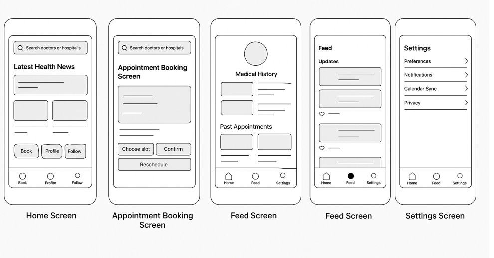

# HMConnect - Healthcare Appointment Scheduling App

## Table of Contents
1. [Overview](#overview)
2. [Product Spec](#product-spec)
3. [Wireframes](#wireframes)
4. [Schema](#schema)

---

## Overview

### Description
HMConnect is a healthcare appointment scheduling app designed to simplify the process of booking medical visits at hospitals and clinics. It allows users to search for healthcare providers, view doctor availability, book or reschedule appointments, and receive timely reminders. The app integrates with device calendars for appointment reminders and allows users to maintain a secure medical history profile. It enhances patient convenience by also offering telehealth consultation options.

### App Evaluation
- **Category:** Healthcare (Appointment Scheduling)
- **Mobile:** This app is designed for mobile devices, making it ideal for on-the-go scheduling. It uses location services to find nearby hospitals and doctors and integrates with device calendars for appointment reminders.
- **Story:** HCare helps users easily manage their healthcare appointments, offering seamless booking, rescheduling, and reminders. It aims to reduce the stress and time-consuming process of appointment scheduling.
- **Market:** Targeted at patients, caregivers, and busy professionals who need easy access to medical services.
- **Habit:** Occasional but highly important usage for healthcare needs. It becomes part of a user's routine when managing doctor visits.
- **Scope:** The app will include moderate complexity, with features like appointment scheduling, calendar integration, and secure medical history storage. API integrations will be necessary to ensure smooth operation.

---

## Product Spec

### 1. User Stories

#### Required Must-have Stories:
1. **Account Management:**
   - Users can sign up, log in, and manage their profile.
   
2. **Search and Book Appointments:**
   - Users can search for doctors/hospitals, view availability, and schedule or reschedule appointments.

3. **Calendar Integration:**
   - Sync with the device calendar to send reminders for upcoming appointments.

4. **Secure Medical History:**
   - Users can maintain a profile with their medical history, allergies, and medications.

5. **Follow Providers:**
   - Users can follow doctors or hospitals to receive notifications about appointments and health tips.

#### Optional Nice-to-have Stories:
1. **Telehealth Integration:**
   - Users can request and schedule telehealth appointments.

2. **Appointment Reminders:**
   - Push notifications for upcoming appointments.

---

### 2. Screen Archetypes

#### Home Screen:
- Displays search options for doctors and hospitals.
- Highlights latest health-related updates or tips in a feed format.
- Features quick links to book appointments, view the user's profile, and follow healthcare providers.

#### Appointment Booking Screen:
- Allows users to search for available doctors and hospitals.
- Users can choose an appointment slot, confirm booking, or reschedule/cancel appointments.

#### Profile & Medical History Screen:
- Displays the user’s personal profile, medical history, and past appointments.
- Allows users to update personal details, health information, and settings.

#### Feed Screen:
- Displays updates from followed healthcare providers, health tips, user-generated content, and health-related news.
- Users can like posts, comment, or share content.

#### Settings Screen:
- Allows users to update preferences, manage notifications, and edit account settings.
- Includes options for calendar synchronization and privacy settings.

---

### 3. Navigation

#### Tab Navigation:
- **Home → Appointment Booking:** User searches for a doctor/hospital and books an appointment.
- **Home → Profile:** User accesses the profile to view/edit medical history and personal details.
- **Profile → Home:** After updating profile or medical history, user returns to home screen.
- **Feed → Home:** Users view posts or health updates from followed healthcare providers and return to the home screen.

#### Flow Navigation:
- **Home Screen → Appointment Booking:** Navigate to search for appointments.
- **Home Screen → Profile:** Navigate to view/edit medical history.
- **Feed Screen → Home:** Return to home after browsing health posts.

---

## Wireframes

---

## Schema

### Models:
1. **User:**
   - Stores personal details, login credentials, and medical history.

2. **Appointment:**
   - Stores appointment details (doctor, date, time, location).

3. **Healthcare Provider:**
   - Stores details about hospitals and doctors.

4. **Notification:**
   - Stores reminders for upcoming appointments.

### Networking:

- **GET /appointments:** Fetch all appointments for the user.
- **POST /appointments:** Create a new appointment.
- **PUT /appointments/{id}:** Update an existing appointment.
- **DELETE /appointments/{id}:** Cancel an appointment.
